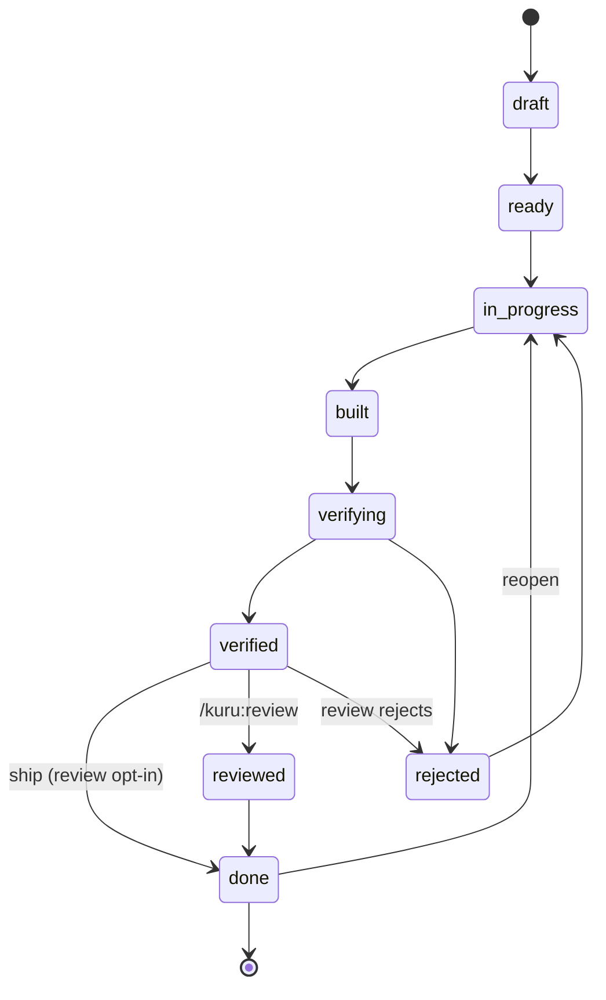

# kurukuru

An enterprise delivery harness for coding agents (Claude Code plugin). It turns a
coding agent into a disciplined pipeline for shipping **production** software
across many sessions — not vibe-coding, not hobby projects.

Shared understanding becomes a PRD; the PRD becomes **vertical slices** that are
small enough for one agent session yet complete enough to build without guessing;
a builder agent implements one slice; a **separate** verifier agent gatekeeps it
against a **frozen contract** with concrete evidence and deterministic gates;
optionally, a slice is also code-reviewed before it ships. Progress is tracked in
files so each session can pick up cold.

## Why (the three sources)

- **Anthropic, _Effective harnesses for long-running agents_** — the progress
  file + checklist + git-history handoff trio, a get-your-bearings startup ritual,
  end-to-end verification before anything is marked done, and guardrails against
  premature "victory." → `progress.md`, `/kuru:bearings`, the gate rules.
- **Anthropic, _Harness design for long-running apps_** — context **resets** over
  in-place compaction; the planner → generator → evaluator separation (separating
  the agent doing the work from the one judging it is the biggest quality lever);
  **sprint contracts** that fix "done" before code is written; evaluators that
  drive the running app and emit evidence-backed findings. → the subagents, frozen
  `contract.yml`, file-based handoffs.
- **OpenAI, _Harness engineering_** — eval-driven gating; every scaffold encodes
  an assumption about what the model can't yet do, so keep gates deterministic and
  measurable. → `kuru gate` + `config.json`.

## The one idea that holds it together

**Facts that gate progress live in machine-checked files, never in an agent's
narration.** A tiny dependency-free engine (`scripts/kuru.py`) owns the truth:
which slices exist, what state each is in, and whether the gates passed. Agents
reason and write prose; they cannot talk past the engine.

Enforced **in code** (not by trust):
1. Illegal state transitions are refused.
2. A slice cannot become `verified` unless a recorded `kuru gate` run passed —
   and is newer than the slice's latest build (stale green runs don't count).
3. A builder (`--by builder`) may not set `verified` or `reviewed`.
4. A slice cannot start while any of its `--depends-on` slices isn't `done`.

(All three are demonstrated by the dry-run in [`impl/BUILD_PLAN.md`](impl/BUILD_PLAN.md) §7, SL-2,
and exercised by [`scripts/selftest.sh`](scripts/selftest.sh).)

## Install

**The plugin.** This is a Claude Code plugin. Requires `python3` (stdlib only — no
pip installs). Add the plugin directory to Claude Code (local plugin or via a
marketplace entry); Claude Code auto-discovers `commands/`, `agents/`, and
`skills/`. Commands appear as `/kuru:*`.

**Engine path.** Commands call the engine as
`${KURU_PY:-${CLAUDE_PLUGIN_ROOT}/scripts/kuru.py}`. Claude Code sets
`CLAUDE_PLUGIN_ROOT` automatically when the plugin loads, so **no configuration is
needed for most users** — the fallback resolves to the right file out of the box.

If that ever fails (e.g. the plugin is symlinked or loaded in an unusual way), pin
the path explicitly. Add to `~/.claude/settings.json`:

```json
{
  "env": {
    "KURU_PY": "/absolute/path/to/kurukuru/scripts/kuru.py"
  }
}
```

Claude Code has no plugin-scoped env mechanism, so this goes in global settings.
It's a one-time addition — once set, it overrides the `CLAUDE_PLUGIN_ROOT` fallback
everywhere and across all workspaces. Restart Claude Code after saving.

The last-resort fallback is the path `kuru init` records in `.kuru/engine` — useful
if neither of the above is set.

**The runner (optional, for unattended runs).** [`runner.py`](runner.py) lives at
the repo root — it is **not** part of the plugin, it's a separate driver that
loops the plugin headlessly (see [Running headless](#running-headless-runnerpy)).
It needs nothing installed beyond `python3` and the `claude` CLI (logged in). You
don't need it for manual `/kuru:*` use.

## Quickstart (in the repo you're building)

```bash
# 1. scaffold the workspace
python3 /path/to/kuru/scripts/kuru.py init                  # creates ./.kuru/
#    or seed gates for a build tool: init --stack node|pnpm|gradle|maven|go|python|cargo
#    or reuse a saved environment:   init --profile ~/.kuru/profiles/   (a catalog dir or URL)
# 2. config.json gets configured for you during /kuru:charter (it interviews you about
#    language, build pipeline, deploy env, and air-gapped constraints, then sets the gates).
#    To (re)pick a preset manually:  kuru.py set-stack gradle   then tailor the commands.
#    Also fill in .kuru/init.sh (one command to bring up the dev environment).
```

Then, in Claude Code:

```
/kuru:charter            # build shared understanding -> .kuru/charter.md
/kuru:prd <feature>      # charter -> .kuru/prd/<feature>.md  (kuru-planner)
/kuru:slice <feature>    # PRD -> vertical slices with frozen contracts
/kuru:build              # kuru-builder implements the next ready slice -> built
/kuru:verify             # kuru-verifier independently gatekeeps -> verified|rejected
/kuru:review             # OPTIONAL code review of a verified slice -> reviewed -> done
/kuru:status             # dashboard      /kuru:next   # what to do next
/kuru:bearings           # run at the start of every session
```

The first three steps need a human (discovery, scoping, slicing). Once slices have
frozen contracts, the rest is mechanical. There are three ways to drive it:

- **In-session (sequential):** `/kuru:loop` runs build → verify → done over the ready
  slices, one at a time, until the board is clear (code review is opt-in — run
  `/kuru:review` by hand). To ship just **one** named slice and stop there, use
  `/kuru:loop-slice <id>` (or `runner.py --slice <id>`).
- **Dynamic workflow (per-slice pipelines):** `/kuru:loop-workflow` runs the same build →
  verify → ship cycle, but it authors a Claude Code **dynamic workflow** — a JavaScript script
  you approve, which the workflow runtime runs in the background. It asks the engine
  `kuru next --all` for the ready set, shows you the plan and dependency edges first, then runs
  **one `build → verify → ship` pipeline per slice**, each stage a **fresh, isolated `agent()`**.
  Concurrency is keyed on the **gate target**: a target runs **at most one** slice's pipeline at
  a time (**same target → serialized** — the no-worktrees lesson: slices share one working tree,
  so parallel builds clobber each other and a build-in-flight contaminates a same-tree verify),
  while **different targets run in parallel** (disjoint subtrees). A slice's pipeline starts only
  once its `depends_on` are all `done`, so a dependent begins the instant its last dep ships. A
  single-target repo thus runs fully sequentially by design; a polyglot/monorepo runs one
  pipeline per app at once. That per-step clean context is the point: it clears a large board
  without saturating the session, which is why it **supersedes the headless `runner.py`**. The
  workflow's agents touch kuru only through `/kuru:build`, `/kuru:verify`, `/kuru:ship --no-commit`
  (never `kuru.py`); the engine serializes ledger writes with a file lock. Ship defers its commit,
  so the launching session makes **one commit after the run** (trading per-slice revert
  granularity for parallel speed). `/kuru:loop-workflow SL-0001,SL-0002` scopes it to a curated
  set — they run in parallel if on different targets, else serialized. (Requires Claude Code
  workflows enabled.)
- **Headless / unattended:** [`runner.py`](runner.py) — sequential — see below.

Across all three, `max-reject-retries` is **per run**: re-running a `loop*` command
resets every slice's retry tally, so the cap governs only the current run.

Both refuse to start until charter + PRD + non-draft (contracted) slices exist,
spawn a fresh builder and a separate verifier per slice, respect inter-slice
**dependencies**, and stop on any `blocked` slice or after `--max-retries`
rejections. The manual `/kuru:*` commands still work alongside either.

### Environment profiles (reuse a stack across projects)

If you spin up many projects with the same stack — especially in an **air-gapped**
org — keep a **catalog** of reusable, **single-stack profiles** (one file per build
flavour) and point `init --profile` at it. `--profile` takes **one location**: a
local directory of `*.json` profiles, a single `.json` file, or a hosted catalog
URL (so a whole org can share one canonical set of profiles):

```bash
# a directory of profiles (the charter picks the ones that apply)
python3 /path/to/kuru/scripts/kuru.py init --profile ~/.kuru/profiles/

# a single profile file
python3 /path/to/kuru/scripts/kuru.py init --profile ~/.kuru/profiles/gradle-kube.json

# a hosted catalog — GitHub contents API or GitLab repository-tree API URL
python3 /path/to/kuru/scripts/kuru.py init \
  --profile 'https://gitlab.example.com/api/v4/projects/42/repository/tree?path=kuru-profiles'
```

For a hosted catalog the engine fetches the listing and each `*.json` blob itself
(reading `GITHUB_TOKEN` / `GITLAB_TOKEN` for private repos). When you run it through
`/kuru:init`, the command will prefer a **skill** that already knows how to fetch
from your host (GitLab/GitHub/Bitbucket, with its tokens) and only falls back to the
engine's built-in fetcher if none is found.

A profile is plain JSON you keep **outside the plugin** (see
[`templates/profile.example.json`](templates/profile.example.json)):

- `stack` — a gate preset (`node|pnpm|gradle|maven|go|python|cargo`) used to seed
  the initial `config.json` at `init`,
- `config` — suggested gate commands (e.g. gradle `--offline` against an internal
  mirror) that `/kuru:charter` uses as a **starting point** for this flavour's gates,
- `environment` — language/version, deploy target, and **internal registry
  endpoints** that pre-fill the charter's Technical environment so you don't
  re-type them each time, and
- `conventions` — org-specific "how we build here" rules that aren't gate commands
  (e.g. "generate the Gradle build files with the `setup-gradle` skill"), each paired
  with the **checkable artifact** it produces. Deterministic ones get compiled into a
  `setup-conformance` gate so a builder that ignores the rule fails a gate, not just a
  reviewer's patience; judgmental ones become acceptance criteria.

The profiles are **guidance, not gospel**, and a **catalog**: point `--profile` at a
location holding several and `/kuru:charter` picks the ones matching the apps it
discovers in this repo (a Kotlin service → the gradle profile; a web app → the pnpm
profile), assigns each a gate
**target** + `dir`, and ignores the rest. `init` seeds a starting `config.json` (from
a lone profile's `stack`, else the node default) and stashes the profiles under
`.kuru/profiles/`. Then `/kuru:charter` reads them, **summarizes back to you, hunts
for gaps to confirm** (including each app's `dir`), writes the authoritative
`config.json` (a flat gate set, or a per-app `targets` map — see [Multiple build
targets](#multiple-build-targets-monorepo--polyglot)), and folds the rest (endpoints,
deploy target, required tooling) into the charter — rather than applying any of it
verbatim. Internal endpoints you'd rather not commit can be left out of the profile
and supplied during the charter.

### Dependencies between slices

`kuru new-slice "<title>" --depends-on SL-0001,SL-0002` records a dependency. The
engine then **refuses to start** a slice (`ready → in_progress`) until every
dependency is `done`, and `kuru next` skips dependency-blocked slices — so the
loop builds in a safe order. (Parallel building of independent slices is a planned
upgrade.)

### Multiple build targets (monorepo / polyglot)

One repo, several apps with different pipelines — say a gradle/kotlin service and a
pnpm web app — don't share one gate set. Define a **gate target per app** in
`config.json`, each with its own working `dir` and `gates`:

```json
{
  "project": "my-monorepo",
  "targets": {
    "api": { "dir": "services/api", "gates": { "build": { "cmd": "./gradlew :api:build", "required": true, "timeout": 1800 } } },
    "web": { "dir": "apps/web",     "gates": { "lint":  { "cmd": "pnpm lint",          "required": true, "timeout": 600  } } }
  }
}
```

Targets are discovered and written during `/kuru:charter` (seed each with
`kuru set-stack gradle --target api`, then set its `dir`); each slice declares its
app at `/kuru:slice` time (`kuru new-slice "…" --target web`, or `kuru set-target
<id> web` after). `kuru gate <id>` then runs **only that target's gates, in that
target's dir** — the JS slice never runs `./gradlew`. `kuru doctor` flags a slice
that has no target once more than one exists.

A single-app repo needs none of this: a flat top-level `gates` keeps working and is
treated as one implicit `default` target at the repo root.

## Running headless (`runner.py`)

`runner.py` is a standalone Python loop (stdlib only) that drives the plugin with
no human in the chair. It reads engine state (`kuru next --json`) to **decide**
the next step, then launches a **fresh `claude -p` session** to **do** it
(`/kuru:build`, `/kuru:verify`) — or, for a verified slice, ships it straight to
`done` itself, since code review is opt-in. It repeats until the board is clear.
Each step is its own process, so context never accumulates and the builder and
verifier are separate processes, not just separate agents. It never writes
progress status itself (the one exception being the verified→done ship), so the
engine's gate/role/dependency rules still gate every transition.

### Setup

1. **Prerequisites:** `python3` and the `claude` CLI, logged in. Confirm with
   `claude --version`. (The runner auto-detects `claude` on `PATH` or common
   install locations; otherwise pass `--claude-bin /path/to/claude`.)
2. **Prove the bridge works** (once): `./scripts/smoke-headless.sh` — it loads the
   plugin into a headless `claude -p` session and confirms a `/kuru:*` command
   resolves.
3. **Get a target repo to the loopable point** with the manual commands:
   `/kuru:charter` → `/kuru:prd` → `/kuru:slice` (these need a human). Now every
   slice has a frozen contract.
4. **Run the loop:**

   ```bash
   # from anywhere; --repo points at the target repo's root (the one with .kuru/)
   python3 /path/to/kuru/runner.py --repo /path/to/target-repo

   # preview the next action without launching claude:
   python3 /path/to/kuru/runner.py --repo /path/to/target-repo --dry-run

   # drive a single slice by id all the way to done, then stop
   # (good for a first run; refuses if it's a draft or its deps aren't done):
   python3 /path/to/kuru/runner.py --repo /path/to/target-repo --slice SL-0003
   ```

By default `--plugin-dir` is the directory holding `runner.py` (this repo). If you
copy `runner.py` elsewhere, pass `--plugin-dir /path/to/kuru` so it can find the
plugin and `scripts/kuru.py`.

### Permissions

Autonomous headless runs can't answer permission prompts, so by default the runner
passes `--permission-mode bypassPermissions` to each `claude -p` step. Two ways to
tighten that:

```bash
# allowlist the exact tools/commands up front via a settings file, no bypass:
python3 runner.py --repo . --permission-mode acceptEdits --settings perms.json
# or restrict the tool set directly:
python3 runner.py --repo . --allowed-tools "Bash Read Edit Write Glob Grep"
```

### Key flags

| Flag | Default | Purpose |
|---|---|---|
| `--repo` | `.` | Target repo containing `.kuru/`. |
| `--plugin-dir` | dir of `runner.py` | Where the kuru plugin lives. |
| `--max-retries` | `2` | Per-slice rejection cap (verifier, or a manual review) before it `blocked`s and stops. |
| `--max-iters` | `100` | Global safety cap on loop iterations. |
| `--permission-mode` | `bypassPermissions` | Passed to `claude` per step. |
| `--settings` / `--allowed-tools` | — | Tighten permissions instead of bypassing. |
| `--model` | — | Passed to `claude --model`. |
| `--dry-run` | — | Preview the next action without launching claude. |
| `--slice <id>` | — | Drive only that slice to done, then stop (refuses if it's a draft or its deps aren't done). |

## The slice state machine



Kept off the diagram for readability: **any → blocked** (and unblock back to
anywhere); **any-except-done → dropped → draft** (retire a slice, resurrect it for
a re-write); and three "step back" edges that let you rework without dropping —
**ready → draft** (re-slice), **built → in_progress** (resume building before
verifying), and **reviewed → in_progress** (reopen a reviewed slice).

**Code review is opt-in.** A verified slice ships straight to `done`; run
`/kuru:review` by hand on the slices that warrant a closer look. A review that
finds real problems rejects the slice (`verified -> rejected`), routing it back to
the builder — there is no `verified -> in_progress`.

**Reaching `done` auto-commits.** Whatever path a slice takes to `done`, the engine
commits the working tree as one slice-sized commit — the code, the `.kuru/`
artifacts, and the ledger transition together (`kuru: ship <id> — <title>`). It's
best-effort: outside a git repo, or if `git commit` fails (no identity, a rejecting
hook), the slice still lands `done` and the engine just warns. The exception is
`set-status <id> done --no-commit`, which flips the ledger but skips the commit — used
by `/kuru:loop-workflow`, where many slices ship into one shared tree and the driver
commits once after the parallel run.

A slice that shouldn't be built after all (wrong scope, superseded) is **dropped**
(`kuru set-status <id> dropped --note "<why>"`) — `next` and the loop ignore it.
Resurrect it via `dropped -> draft` to re-write its contract under the same id, or
cut a new slice; `doctor` flags anything still depending on a dropped slice.

## Files

The plugin (the tool):

```
kuru/                       ← the plugin (auto-discovered by Claude Code)
├── .claude-plugin/plugin.json
├── commands/        init charter prd slice build verify review ship status next bearings loop loop-slice loop-workflow
├── agents/          kuru-planner  kuru-builder  kuru-verifier
├── skills/          kuru-method writing-prds slicing-work building-a-slice verifying-a-slice loop-workflow
├── scripts/kuru.py  the deterministic state + gate engine (single source of truth)
├── scripts/selftest.sh  regression test for the engine's guarantees
├── scripts/smoke-headless.sh  proves /kuru:* resolves in a headless `claude -p` session
└── templates/       artifact templates (config[.stack].json, init.sh, …) copied into target repos

runner.py                   ← standalone headless driver (NOT part of the plugin)
impl/                        ← internal docs, not shipped with the plugin
├── BUILD_PLAN.md    full implementation spec
└── TASKS.md         remaining validation tasks / changelog
```

The `.kuru/` workspace (per target repo, created by `kuru init`):

```
.kuru/
├── config.json   ledger.json   charter.md   progress.md   init.sh
├── prd/<feature>.md
└── slices/<id>/  slice.md  contract.yml  build-log.md  verification.md  gate-results.json
```

`ledger.json` + `gate-results.json` are machine truth (only `kuru.py` writes
them). Everything else is narrative written by agents.

**Commit `.kuru/`** in the target repo — it's the project's delivery memory.
`kuru init` writes a `.kuru/.gitignore` that excludes the machine-local bits (the
absolute `engine` path and transient `gate-*.log` files); everything else is meant
to be shared.

## Design principles

- **Context resets, not vibes** — each phase is a clean file handoff; sessions
  start with `/kuru:bearings`.
- **Separate work from judgment** — the builder never verifies its own slice.
- **Frozen contracts** — "done" is fixed before code is written; scope changes mean
  a new slice, never silent drift.
- **Deterministic gates** — typecheck/lint/test/build are run by the engine and
  recorded; green gates are necessary but never sufficient.
- **Evidence over assertion** — verification passes only on facts the verifier
  observed by exercising the running system.

## Service

status: in-progress
team: [[team:jxhui]]
domain: [[domain:ai-agents]]
version: 0.7.0

depends_on:
  - Claude Code (plugin host — auto-discovers commands/, agents/, skills/)
  - python3 stdlib (kuru.py engine; no third-party deps, ever)
  - claude CLI + login (runner.py headless mode only)

exposes:
  - /kuru:init        — scaffold a .kuru/ workspace in the target repo
  - /kuru:charter     — discovery session → charter.md
  - /kuru:prd         — charter → PRD via kuru-planner
  - /kuru:slice       — PRD → vertical slices with frozen contracts
  - /kuru:build       — kuru-builder implements the next ready slice
  - /kuru:verify      — kuru-verifier independently gatekeeps a built slice
  - /kuru:review      — optional code review before marking done
  - /kuru:ship        — mark a verified/reviewed slice done (auto-commits)
  - /kuru:loop          — autonomous build→verify→done loop over all ready slices (sequential)
  - /kuru:loop-slice    — same loop scoped to a single named slice
  - /kuru:loop-workflow — parallel build→verify→ship over all ready slices, as a dynamic workflow
  - /kuru:next        — print and start the next actionable slice
  - /kuru:status      — delivery dashboard
  - /kuru:bearings    — session startup ritual (context-reset recovery)
  - runner.py         — standalone headless driver (not part of the plugin)
  - scripts/kuru.py   — deterministic state + gate engine (CLI, callable directly)

events:
  publishes: []
  subscribes: []

see_also:
  - [[adr:ADR-001]]  # planner/builder/verifier separation
  - impl/BUILD_PLAN.md  # original spec (legacy — code wins on conflicts)
