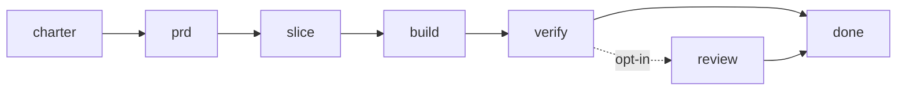
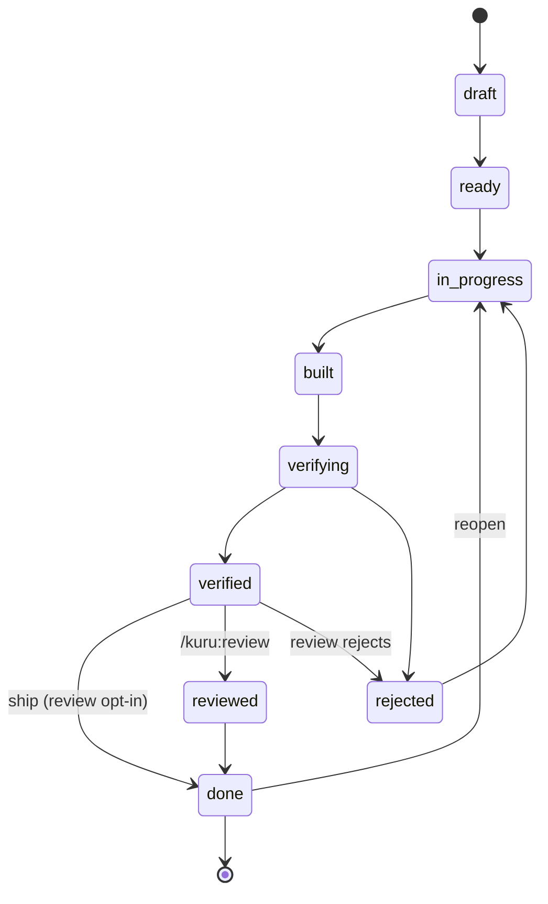

# The Kurukuru method

Kurukuru is a delivery harness for building **production** software with coding
agents across many sessions. It exists to stop the two failure modes that kill
long-running agent work: **premature "victory"** (declaring done what isn't) and
**context-reset amnesia** (each session starting blind). It does that by making
the facts that gate progress live in machine-checked files, never in an agent's
narration.

## The pipeline

- **charter** — shared understanding with the humans. Problem, users, success
  metrics, constraints, non-goals. (`/kuru:charter`)
- **prd** — charter becomes a PRD per feature/epic: what & why, functional and
  **non-functional** requirements, acceptance shape. (`/kuru:prd`, skill
  `writing-prds`)
- **slice** — a PRD becomes **vertical slices**: each small enough for one
  session's context, complete enough to build without guessing, with a **frozen
  contract**. (`/kuru:slice`, skill `slicing-work`)
- **build** — the `kuru-builder` subagent implements ONE slice, runs gates, sets
  status `built`. (`/kuru:build`, skill `building-a-slice`)
- **verify** — a SEPARATE `kuru-verifier` subagent gatekeeps against the frozen
  contract with concrete evidence. (`/kuru:verify`, skill `verifying-a-slice`)
- **review** *(opt-in)* — code review on the diff for slices that warrant a closer
  look. Not a required step: a verified slice ships straight to `done`, and the
  loop never runs review. (`/kuru:review`)
- **ship** — the terminal transition: a `verified` (or `reviewed`) slice → `done`, which
  auto-commits the working tree. Humans can run `set-status <id> done` directly;
  `/kuru:ship <id>` is the thin command wrapper an automated driver (`/kuru:loop-workflow`)
  uses, since workflow agents can't run `kuru.py`. With `--no-commit` it flips the ledger
  but skips the commit (the parallel driver ships many slices into one tree, then commits
  once after the run).

**Open questions gate the move from charter → PRD → slice.** Ambiguity is cheapest
to catch at the charter, and must be resolved at the latest in the PRD — *with the
user*, folding answers back into the doc. Never start slicing while a blocking open
question is unresolved; slicing freezes the PRD into contracts, so an unanswered
question becomes a guess locked inside one.

The first three phases need a human. Once every slice has a frozen contract, the
build → verify → done cycle is mechanical and can be driven
automatically by `/kuru:loop` (optional) — it acts on `kuru next` in order,
spawning a fresh builder and a **separate** verifier per slice, and stops on any
`blocked` slice, a `draft` (uncontracted) slice, or repeated rejection. It never
runs charter/PRD/slicing for you. To ship a **single** named slice and stop there,
use `/kuru:loop-slice <id>`, which drives only that slice via `kuru next --slice
<id>` (so it can't drift onto a ready sibling the board would rank first). To work
**several independent slices in parallel**, use `/kuru:loop-workflow` — it authors a
Claude Code **dynamic workflow** (a JS script the user approves and the workflow runtime runs
in the background) that drives **one `build → verify → ship` pipeline per slice**, each stage a
**fresh, isolated `agent()`**. Concurrency is keyed on the **gate target**: a target runs **at
most one** slice's pipeline at a time (**same target → serialized** — the no-worktrees lesson:
the slices share one working tree, so parallel builds clobber each other and a build-in-flight
contaminates a same-tree verify, which re-runs the gates and drives the app), while **different
targets run in parallel** (disjoint subtrees can't contaminate each other). A slice's pipeline
starts only once its `depends_on` are all `done`, so the dependency DAG is honored and a
dependent begins the instant its last dep ships. A single-target repo runs fully sequentially by
design; a polyglot/monorepo runs one pipeline per app at once. That per-step clean context is the
point: it clears a large board without saturating the session, which is why it supersedes the
headless `runner.py`. The workflow's agents touch kuru only through the `/kuru:*` commands
(`/kuru:build`, `/kuru:verify`, `/kuru:ship --no-commit`), never `kuru.py` directly, so the
"only `kuru.py` mutates the ledger" rule holds; the engine serializes ledger writes with a file
lock (`.kuru/.ledger.lock`). Ship defers its commit (`--no-commit`); the launching session makes
**one commit after the run** instead of one per slice — trading per-slice revert granularity for
parallel speed. Scope it to a curated set (`/kuru:loop-workflow SL-0001,SL-0002`) or omit for the
whole board. See the `loop-workflow` skill for the design and the reference script.
`max-reject-retries` is **per run** (a re-run resets every slice's tally).

## The slice state machine (enforced by kuru.py)

Off the diagram: **any → blocked** (unblock back to anywhere); **any-except-done →
dropped → draft** (retire/resurrect); and three "step back" edges for reworking
without dropping — **ready → draft**, **built → in_progress**, and
**reviewed → in_progress**.

Code review is **opt-in**: a verified slice ships straight to `done`, and the loop
never reviews. When you do run `/kuru:review`, both the verifier (`verifying ->
rejected`) and that review (`verified -> rejected`) can send a slice back to the
builder. There is no `verified -> in_progress`; a failed review rejects, and
`rejected -> in_progress` resumes the build.

`dropped` retires a slice that should not be built (wrong scope, superseded —
`kuru set-status <id> dropped --note "<why>"`). `next` and the loop ignore it.
Resurrect it with `dropped -> draft` to re-write its contract under the same id
(dependents stay valid), or cut a new slice; `doctor` flags any slice that still
depends on a dropped one. Shipped (`done`) work cannot be dropped.

Four rules are enforced **in code** — you cannot talk your way past them:
1. Illegal transitions are refused.
2. A slice cannot reach `verified` unless a recorded gate run exists, **passed**,
   and is **fresh** — newer than the slice's latest transition into `built`
   (`kuru gate <id>` must be re-run after a rebuild).
3. `--by builder` may not set `verified` or `reviewed`.
4. A slice cannot **start** (`ready → in_progress`) while any of its
   `--depends-on` slices is not `done`.

## Three non-negotiable disciplines

- **Separation of work and judgment.** The agent that builds a slice never
  verifies it. Building is collaborative; verifying is adversarial. This
  separation is the single biggest quality lever (it's why `/kuru:verify`
  dispatches a fresh `kuru-verifier` subagent).
- **Context resets, not vibes.** Each phase is a clean handoff through files.
  Do not rely on what was said earlier in the chat. At session start run
  `/kuru:bearings` to reconstruct state from `progress.md`, `ledger.json`, and
  git. At session end, update `progress.md`. If you're running low on context,
  **do not fake done to wrap up** — set the slice `blocked` with a note.
- **Outcomes gate, not means.** A requirement the engine can't check ("use skill
  X", "follow convention Y") is only as real as the checkable artifact you attach
  to it. Express required means as verifiable ends — a gate or an acceptance
  criterion — or they're suggestions a builder will rationalize away.

## Artifacts (where truth lives)

| File | Truth | Written by |
|---|---|---|
| `.kuru/ledger.json` | **machine** — slices + status + history | `kuru.py` only |
| `.kuru/slices/<id>/gate-results.json` | **machine** — gate pass/fail | `kuru gate` |
| `.kuru/charter.md` | narrative | charter session |
| `.kuru/prd/<f>.md` | narrative | planner |
| `.kuru/slices/<id>/slice.md` | narrative spec | slicer |
| `.kuru/slices/<id>/contract.yml` | narrative, **frozen at `ready`** | slicer |
| `.kuru/slices/<id>/build-log.md` | narrative | builder |
| `.kuru/slices/<id>/verification.md` | narrative + evidence | verifier |
| `.kuru/progress.md` | narrative handoff | every session |

Never hand-edit `ledger.json` or `gate-results.json`. Use kuru subcommands.

**Gate targets (monorepo).** `config.json` holds the gates. A single-app repo uses
a flat top-level `gates`. A repo with several apps/build flavors uses a `targets`
map — one entry per app, each with its own working `dir` and `gates` — and every
slice carries a `target` (set at `/kuru:slice`). `kuru gate <id>` then runs only
that target's gates, in that target's dir. A flat config behaves as one implicit
`default` target, so nothing changes for single-app repos.

## kuru.py command reference

Invoke as `python3 "${KURU_PY:-${CLAUDE_PLUGIN_ROOT}/scripts/kuru.py}" <cmd>`.

**Finding the engine.** `kuru.py` lives in the installed plugin, not in the target
repo, so resolve its path in this order:
1. **`$KURU_PY`** — an absolute path to `kuru.py`. The most reliable option; set it
   once in the kurukuru plugin's env (Claude Code plugin settings) so every command
   and the Bash tool see it.
2. **`${CLAUDE_PLUGIN_ROOT}/scripts/kuru.py`** — works when that env var is present.
3. **`.kuru/engine`** — a file `kuru init` writes containing the engine's absolute
   path, captured at init. If the two env vars above aren't set, run
   `python3 "$(cat .kuru/engine)" <cmd>` from the repo root. (`kuru init --force`
   refreshes it if the plugin moved.)

| Command | Effect |
|---|---|
| `init [--force] [--stack <tool>] [--profile DIR\|URL]` | Scaffold `.kuru/` (optionally from a build-tool preset, or a *catalog* of reusable env profiles — a local directory of `*.json`, a single file, or a GitHub/GitLab tree URL — stashed under `.kuru/profiles/` for the charter to match to apps). |
| `set-stack <tool> [--target N] [--discard-flat-gates \| --migrate-flat-gates-to NAME]` | Rewrite `config.json` gates from a preset: `node\|pnpm\|gradle\|maven\|go\|python\|cargo`. With `--target`, seed/replace just that one gate target (monorepo), preserving the others. When `--target` first converts a single-app (flat `gates`) config to multi-app, it **refuses** until you say what happens to the flat gates: `--discard-flat-gates` (drop the init default) or `--migrate-flat-gates-to NAME` (keep it as target `NAME`, `dir "."`). |
| `new-slice "<title>" [--epic E] [--depends-on SL-..,SL-..] [--target N]` | Create `SL-NNNN` + artifacts; status `draft`. `--target` binds it to a `config.json` gate target (monorepo). |
| `set-target <id> <target>` | Assign/repoint a slice to a `config.json` gate target. |
| `ls [--status S] [--json]` | Table (or JSON array) of slices. |
| `show <id> [--json]` | Slice JSON + artifact presence (+ gate + rejection count). |
| `next [--json] [--slice <id>] [--all]` | Next actionable slice, in pipeline order (skips dependency-blocked slices). With `--slice`, the next action for **that one slice only** (or `none` with reason `done`/`blocked`/`waiting_on_deps`) — what `/kuru:loop-slice` drives on. With `--all`, **every** slice actionable now (deps satisfied) plus `waiting`/`draft`/`blocked`/`done` — the parallel batch `/kuru:loop-workflow` drives on. |
| `set-status <id> <status> [--note ..] [--by human\|builder\|verifier\|reviewer] [--no-commit]` | Guarded transition. Transitioning **to `done` auto-commits** the working tree (`kuru: ship <id> — <title>`); best-effort, never blocks the transition. **`--no-commit`** flips the ledger to `done` but skips the commit, leaving it to the caller (used by `/kuru:loop-workflow`, which commits once after the parallel run). Serialized by `.kuru/.ledger.lock` so parallel `loop-workflow` writes don't race. |
| `gate <id>` | Run the slice's gates; write `gate-results.json`; non-zero on fail. In a multi-target repo, runs only the slice's target's gates, in that target's `dir`. |
| `check <id>` | Read-only: may this slice reach `verified`? |
| `doctor` | Validate the workspace. Hard ✗ on missing core files / no gates / unknown deps; a target `dir` that doesn't exist **yet** (a not-yet-built slice will create it) is a ⚠ warning, not a failure. |
